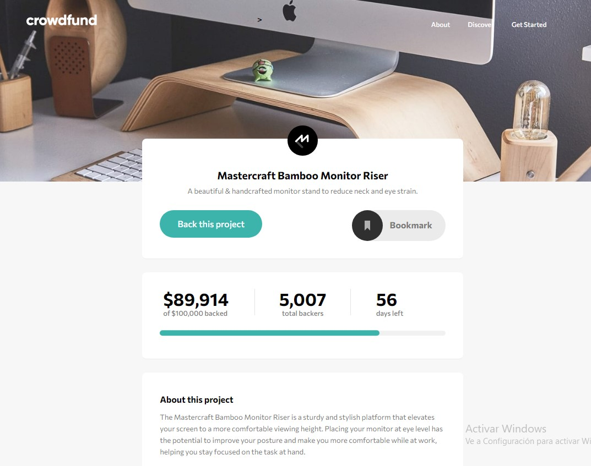
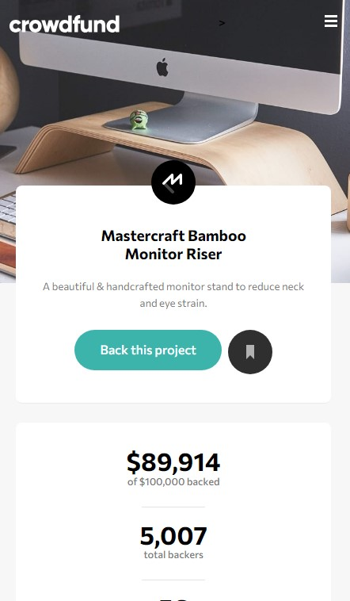

# Crowdfunding Product Page: Interactive Fundraising Component

> [!Note]
>> This repository contains a legacy project from my early days as a programmer

This repository is evidence of my learning journey. It represents a project I undertook to refine my layout and complex component logic skills before my current specialization in Full Stack development.

**Note:** The design and assets were provided by Frontend Mentor. My role was the technical implementation from scratch.

---

## 🌟 About this project
The **Mastercraft Bamboo Monitor Riser** is a conceptual crowdfunding landing page. This project was my first deep dive into building a "system" rather than just a page. 

The core objective was to create a seamless user experience where backers could:
1. View project progress in real-time via a dynamic progress bar.
2. Interact with a multi-step selection modal to choose different reward tiers.
3. Experience a fully responsive interface that transitions smoothly from mobile to desktop.

It showcases the transition from basic HTML structures to interactive components that handle data (donations, backer counts, and stock availability) using Vanilla JavaScript.

---

## 🚀 Links
* **Live Demo:** [SEE DEMO HERE](https://cmp2007.github.io/Crowdfunding-product-page/)
* **Frontend Mentor Profile:** [View my solutions](https://www.frontendmentor.io/profile/CMP2007)
* **Original Challenge:** [Crowdfunding product page](https://www.frontendmentor.io/solutions/crowdfunding-product-page-jYddIafWyj)

### Screenshot

---

## 📋 Evolution & Context Note
> ⚠️ **Note on my trajectory:** This project was a major milestone where I moved beyond simple UI components to a more complex system involving state management (manual), modal flows, and form validations. It documents my transition from basic static pages to interactive web applications using **Vanilla JavaScript**.

## 📋 Technical Milestones of this Stage
In this phase of my learning, I successfully implemented:

* **Stateful UI Logic:** Developed a system to track total donations and backer counts, updating the UI dynamically (including a functional progress bar) without page reloads.
* **Complex Modal Flow:** Implementation of a multi-step modal system for reward selection, including "Success" alerts and background scroll locking for better UX.
* **Semantic Disclosure Widgets:** Extensive use of the `
` and `
` tags, not just for menus but as a structural base for the interactive reward selection forms.
* **Advanced CSS Layouts:** Combined **CSS Grid** and **Flexbox** to handle a complex responsive design, including a hero image swap via CSS and custom radio button styling.
* **Data Validation & Formatting:** Used the `Intl.NumberFormat` API to ensure currency and numbers were displayed correctly to the user after each donation.

## 🛠️ Technologies (at the time)
* **Vanilla JavaScript:** Complex event handling, arithmetic logic for crowdfunding goals, and DOM manipulation.
* **HTML5 & CSS3:** Semantic structure, custom form elements, and advanced Responsive Design.
* **Normalize.css:** Ensuring consistent rendering across all modern browsers.
